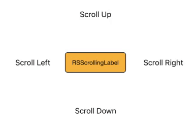

# RSScrollingLabel

[](https://travis-ci.org/terrordrummer/RSScrollingLabel)
[](https://cocoapods.org/pods/RSScrollingLabel)
[](https://cocoapods.org/pods/RSScrollingLabel)
[](https://cocoapods.org/pods/RSScrollingLabel)

## Description


This is a simple UIView that emulates an UILabel and allows to animate text. To perform a text animation just call the following function:

```swift
func animate(to text: String, direction: Direction)
```

The four main direction are available:

```swift
enum Direction {
        case up, down, left, right
    }
```


RSScrollLabel also wraps the following common UILabel properties:

* `textAlignment`
* `textColor`
* `font`
* `text` (not animated)

## Example

To run the example project, clone the repo, and run `pod install` from the Example directory first.

## Installation

RSScrollingLabel is available through [CocoaPods](https://cocoapods.org). To install
it, simply add the following line to your Podfile:

```ruby
pod 'RSScrollingLabel'
```

## Author

terrordrummer, roberto.sartori@gmail.com

## License

RSScrollingLabel is available under the MIT license. See the LICENSE file for more info.
